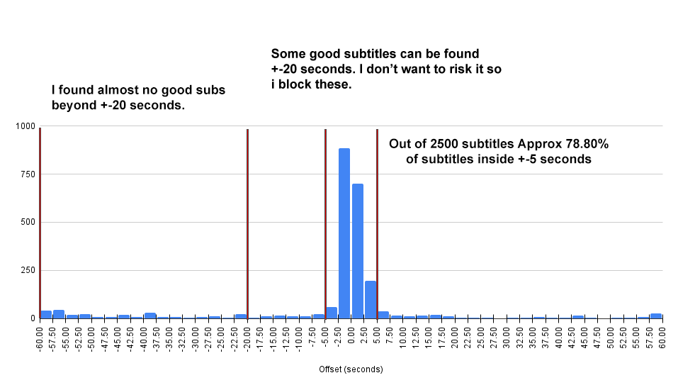

# Subtitle QC based on offset value from audio-sync

I had issues with subtitles being out of sync so I created (with 99% help from ChatGPT) this script that will auto-blacklist any subtitle that has been synced by more than ±5 seconds.

My logic is that IF a subtitle is synced more than ±5 seconds there is something wrong with it and I would rather blacklist it and search for a new one.

*After syncing ~2500 subtitles, my experience is:*

-   *ALMOST all files under ±5 sec will produce a good sync.*
-   *SOME files above ±5 seconds will produce a good sync.*
-   *ALMOST all files above ±20 seconds will produce a bad sync.*

*That is why I set my limit at ±5 seconds (you can set this in the config).*




This script automates the blacklisting of downloaded subtitles in Bazarr.  
It checks:

- ✅ Subtitle-to-video sync accuracy, blocklist and search if above set limit.
- ✅ Detected subtitle language vs. expected language, blocklist if not matching.


⚠️ NOTE: This will search for a new subtitle until the subtitles run out/you hit your predefind minimum score. So if your providers find 50 subtitles above your minimum score, this script will try everyone until it finds one +-5 seconds.

⚠️ NOTE: This will sync all subtitles you download (except embedded subtitles since they have a score of 100%)
 
---

## ⚙️ How It Works

When Bazarr downloads a subtitle, `bazarr-qc.py` is executed via the post-processing hook. It:

1. Exports subtitle metadata (IDs, language, file path).
2. The Python script:
   - Reads Bazarr's SQLite DB for offset info.
   - Detects language of downloaded file (optional) and checks against bazarr if its correct, if not; blacklist.
   - If an offset of more than ±5 seconds is found, blacklists the subtitle using Bazarr's API and start a new search.

---

## 🔧 Setup

Place file in /bazarr/config/
>bazarr-qc.py


In Bazarr settings:

__Enable: Automatic Subtitles Audio Synchronization__
-  Series Score Threshold For Audio Sync: 100
-  Movies Score Threshold For Audio Sync: 100

__Enable: Custom Post-Processing__
 - Series Score Threshold For Post-Processing: Disabled
 - Movies Score Threshold For Post-Processing: Disabled
 - Command: /config/bazarr-qc.py "{{episode_id}}" "{{series_id}}" "{{provider}}" "{{subtitle_id}}" "{{subtitles_language_code2}}" "{{subtitles}}"

---


## 🔧 Configuration

Edit the top of `bazarr-qc.py` to adjust:

```python
ALLOWED_OFFSET_SECONDS = 5.0  # Max allowed offset (+/-) before blacklist occurs.
API_KEY = "your_api_key_here" # API key from Bazarr (settings/general).
API_HOST = "your_ip"
API_PORT = "6767"
DB_PATH = "/config/db/bazarr.db" #IF it does not find the .db, play around with this.

ENABLE_LOGGING = True                 # Log actions to file
ENABLE_LANGUAGE_DETECTION = True     # Detect language using guess_language
```
---

## 📂 Files

- `bazarr-qc.py`: Main Python script that performs offset-extraction, blacklisting and language checks.

---

## Trash-guides

I know trash-guides recommends not syncing subs with a high score (might put your good synced subs offset), in my experience I have not had an issue with this.
